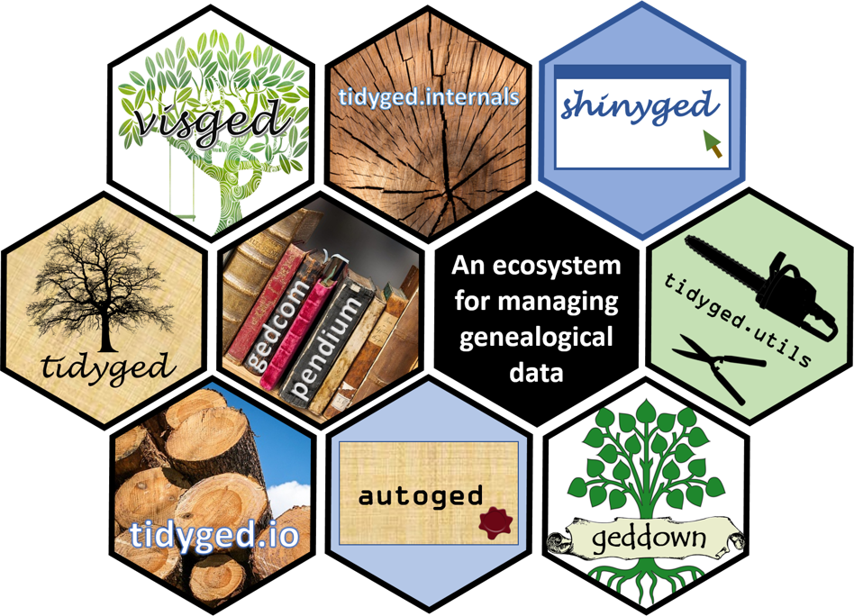

<!-- README.md is generated from README.Rmd. Please edit that file -->

```{r, include = FALSE}
knitr::opts_chunk$set(
  collapse = TRUE,
  comment = "#>",
  fig.path = "man/figures/README-",
  out.width = "100%"
)
```

# tidyged.internals 

<!-- badges: start -->
[](https://github.com/jl5000/tidyged.internals/actions)
[](https://codecov.io/gh/jl5000/tidyged.internals)
[](https://www.codefactor.io/repository/github/jl5000/tidyged.internals)
[](https://www.tidyverse.org/lifecycle/#stable)
<!-- badges: end -->

This package contains the internal data structures used to represent family tree GEDCOM files. It codifies the rules in the [GEDCOM 5.5.5 specification](https://www.gedcom.org/gedcom.html).

The package is part of the `gedcompendium` ecosystem of packages. This ecosystem enables the handling of `tidyged` objects (tibble representations of GEDCOM files), and the main package of this ecosystem is [`tidyged`](https://jl5000.github.io/tidyged/).

The `tidyged.internals` package is only to be used by developers of `tidyged` and its extensions.


```{r, echo=FALSE, out.width="65%", fig.align='center'}

```


## Installation

You can install the development version from [GitHub](https://github.com/) with:

``` r
# install.packages("remotes")
remotes::install_github("jl5000/tidyged.internals")
```

