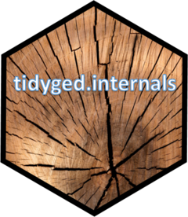

# tidyged.internals 

<!-- badges: start -->

[](https://github.com/jl5000/tidyged.internals/actions)
[](https://codecov.io/gh/jl5000/tidyged.internals)
[](https://www.codefactor.io/repository/github/jl5000/tidyged.internals)
[](https://www.tidyverse.org/lifecycle/#maturing)
<!-- badges: end -->

This package contains the internal data structures used in the [`tidyged`](https://github.com/jl5000/tidyged) package. It codifies the rules in the [GEDCOM 5.5.5 specification](https://www.gedcom.org/gedcom.html).

It is only to be used by developers of tidyged and its extensions.

## Installation

You can install the development version from [GitHub](https://github.com/)
with:

``` r
# install.packages("devtools")
devtools::install_github("jl5000/tidyged.internals")
```

